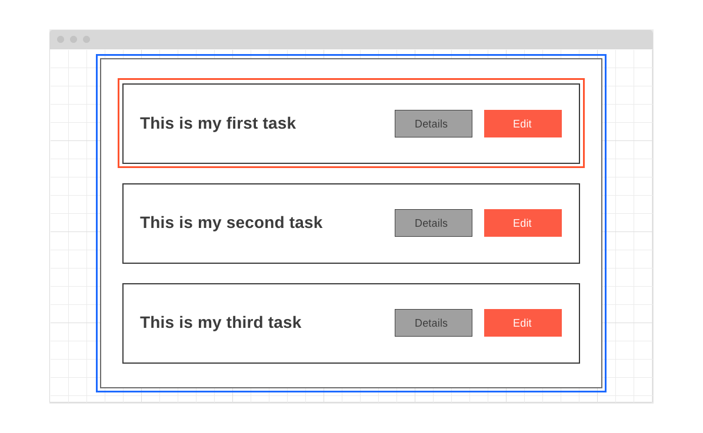
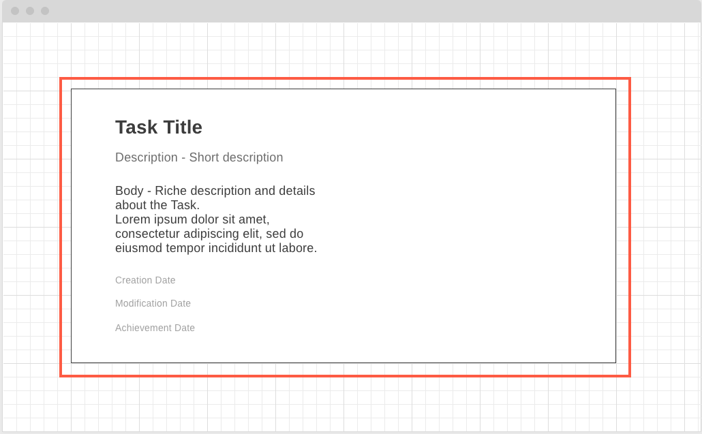
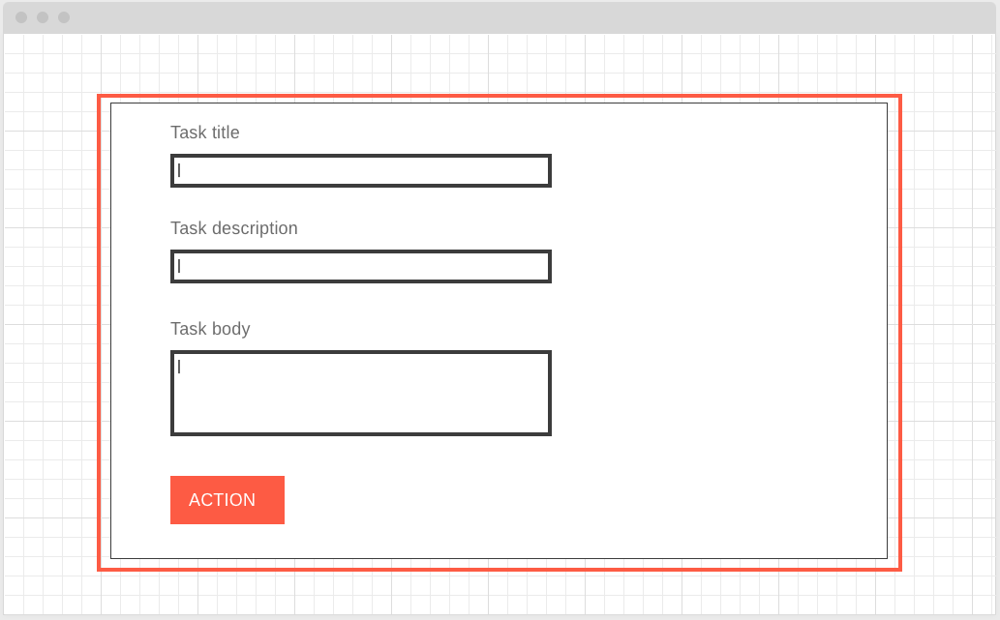

#Todo App

## Découper l'interface en composants

Avant de plonger dans le code il est important de faire un travail de plannification en amont pour structurer notre projet et découper notre interface en composant pour un code plus compréhensible, maintenable et scalable. 

Le rôle de l’interface utilisateur est de représenter graphiquement, de manière esthétique et fonctionnelle, le modèle de donnée envoyé par le serveur qui doit être affiché à l’utilisateur. SI ce modèle à bien été conçu en amont, l’interface utilisateur est donc très souvent le reflet de ce modèle. Chaque composant de notre UI doit faire qu’une seule et unique chose et correspondre à élément de notre modèle.

En fonction du cahier des charges qui m'a été fourni j'ai défini le modèle donnée avec lequel je vais travailler coté front. C'est un mock qui représente un modèle de donnée JSON qu'un serveur pourrait envoyé au client. 

### Page 1: Afficher la liste des tâches

La première page est accessible lorsqu’on lance l’application : elle affiche une liste de todo. Sur chaque ligne de cette liste apparaît le titre du todo au bout : un bouton pour modifier le todo et un bouton pour voir le détail du todo. En dessous de cette liste il faut un bouton Créer un todo. Voici Le modèle de donnée pour cette page: 


```
{
	tasks: [
	{
  		"_id": "5cf0029caff5056591b0ce7d",
  		"title": "Ma première tâche",
  		"description": "Créer une application type todo list",
  		"body" : "L’application est une “todo list”. Un todo est composé d’un id, d’un titre (title), d’un corps de message (body), d’une date de création, d’une date de modification et d’une date de traitement."
  		"createdAt": "2020-11-20T12:40:45Z",
  		"modfiedAt": "2020-11-20T18:33:48Z",
  		"archivedAt": "2020-11-22T12:10:48"
	}
	{
  		"_id": "9cf0029caff5024531b0ce7d",
  		"title": "Une seconde tâche",
  		"description": "Mettre en ligne l'application",
  		"body" : "Lorem ipsum dolor sit amet, consectetur adipiscing elit. Cras justo urna, placerat ac fermentum malesuada, eleifend sit amet sapien. Proin condimentum dolor non urna iaculis finibus."
  		"createdAt": "2020-11-22T08:13:45Z",
  		"modfiedAt": "2020-11-22T10:30:48Z",
  		"archivedAt": "2020-11-23T12:00:00"
	}
]
}
```

| Field | Type | Description |
| ----- | ---- | ----------- |
| tasks | Array | A list of Tasks |

En fonction du modèle de donnée et du cahier des charges j'ai décidé de découper mon interface principale en deux composant: 

+ TasksList (bleu): Affiche la collection de tâches 
+ Task (rouge): Affiche le titre d'une tâche, le bouton qui redirige vers la page qui affiche les détails d'une tâche et celui qui redirige l'utilisateur vers la page d'édition de la tâche.

Le cahier des charges stipule également que l'on retrouver en bas de la page un boutton qui redirige vers la page de création d'une tâche. Il n'est pas nécessaire de créer un composant pour ce dernier car il ne tient pas de logique et n'est pas réutiliser dans l'application. 



Ma hiérarchie de composant ressemble donc à: 

```
- TasksList
	- Task
```

###Page 2: Afficher les détails d'une tâche

La deuxième page est accessible en cliquant sur le détail d’une todo : elle affiche tous les attributs d’un todo récupéré. Le modèle de donnée pour cette page est le suivant: 


```
{
  "_id": "5cf0029caff5056591b0ce7d",
  "title": "My first ever task",
  "description": "Créer une application type todo list",
  "body" : "L’application est une “todo list”. Un todo est composé d’un id, d’un titre (title), d’un corps de message (body), d’une date de création, d’une date de modification et d’une date de traitement."
  "createdAt": "2020-11-20T12:40:45Z",
  "modfiedAt": "2020-11-20T18:33:48Z",
  "archivedAt": "2020-11-22T12:10:48"
}
```

| Field | Type | Description |
| ----- | ---- | ----------- |
| _id | String | The Task ID |
| title | String | The Task Title |
| description | String | Short description of the Task |
| body | String | Riche details about the Task |
| createdAt | String | Creation date of the Task in ISO 8601 format |
| modfiedAt | String | Modification date of the Task in ISO 8601 format |
| archivedAt | String | Achievement date of the Task in ISO 8601 format |



On va donc créer un composant dont le rôle va être de représenter graphiquement à l'utilisateur des détails relatifs à la tâche. 

+ TaskDetails (rouge): Affiche les attributs d'une tâche. 

###Page 3: Modification / Création d'une tâche 

La troisième page accessible soit en cliquant sur Créer un todo sur la première page soit en cliquant sur modifier un todo, permet de modifier ou créer un todo supplémentaire.

L'idée ici est d'avoir un composant qui permet à l'utilisateur de créer un modèle de donnée représentant une tâche ou modifier un modèle existant, puis d'envoyer ce nouveau modèle au serveur (ou le faire persisté directement dans le state de l'application coté front).

On va donc utiliser un formulaire qui va collecter via ces inputs les différentes informations dont on a besoin pour créer ou modifier une tâche.

```
{
  "title": "My first ever task",
  "description": "Créer une application type todo list",
  "body" : "L’application est une “todo list”. Un todo est composé d’un id, d’un titre (title), d’un corps de message (body), d’une date de création, d’une date de modification et d’une date de traitement."
}
``` 

| Field | Type | Description |
| ----- | ---- | ----------- |
| title | String | The Task Title |
| description | String | Short description of the Task |
| body | String | Riche details about the Task |



On va donc créer un composant dont le rôle va être de collecter les informations nécessaire pour construire le modèle de donnée JSON représentant la nouvelle tâche/tâche modifiée. 

+ TaskDetails (rouge): Collecte les attributs d'une tâche. 


## Conception de la version statique 


